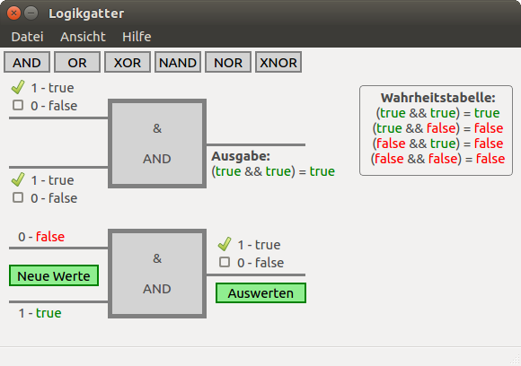

# Logikgatter
**In English:** Logic gate

Explains the logic for: AND, OR, XOR, NAND, NOR and XNOR

## Development
Build with "[QT Creator](https://www.qt.io/download/) 4.0.3" based on "Qt 5.6.1".

## Screenshots

